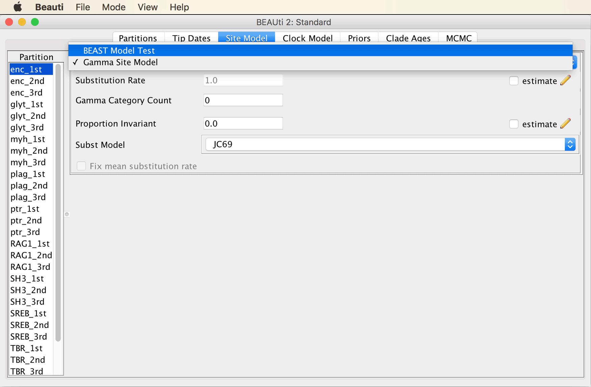
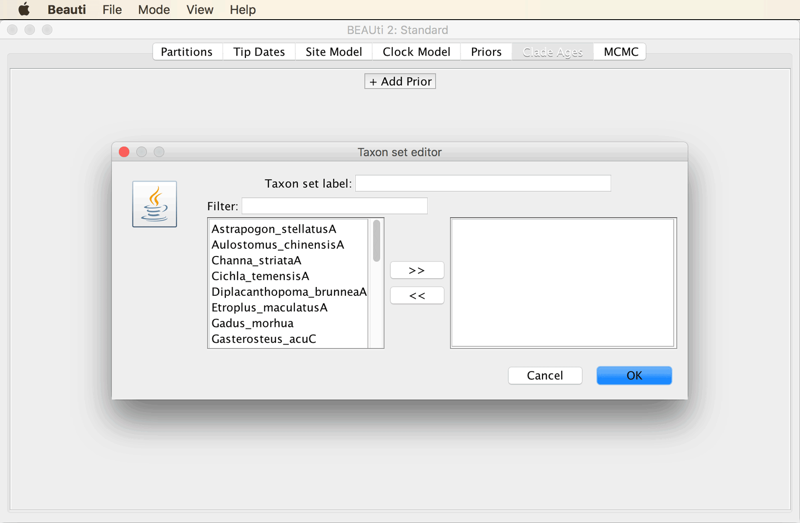
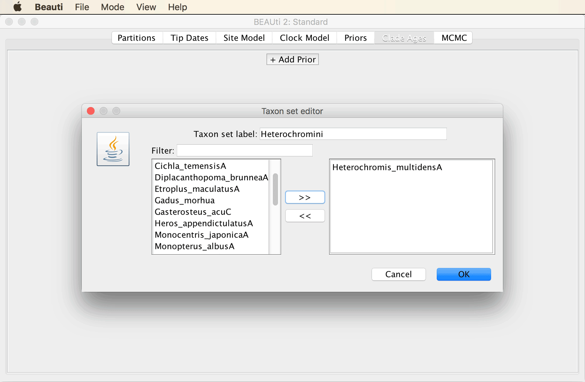
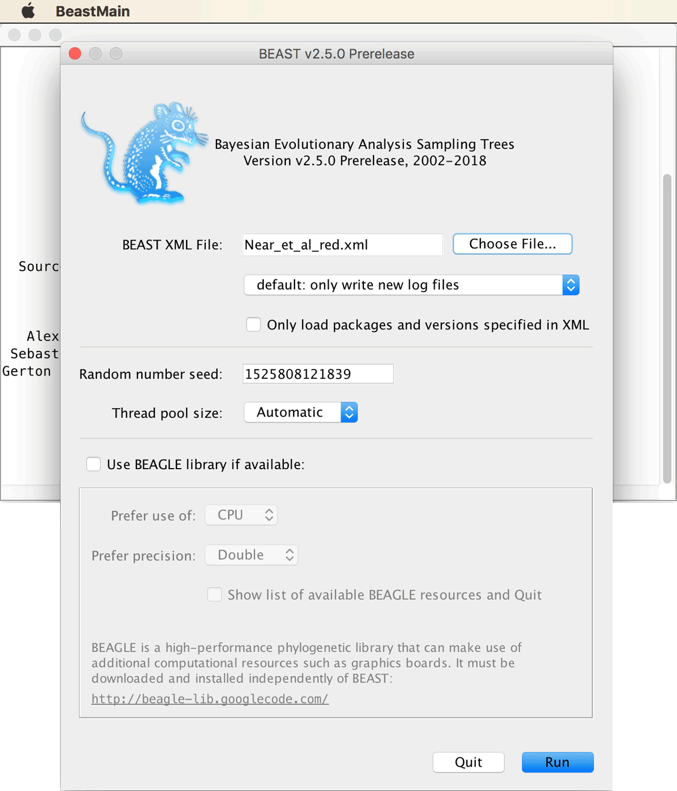
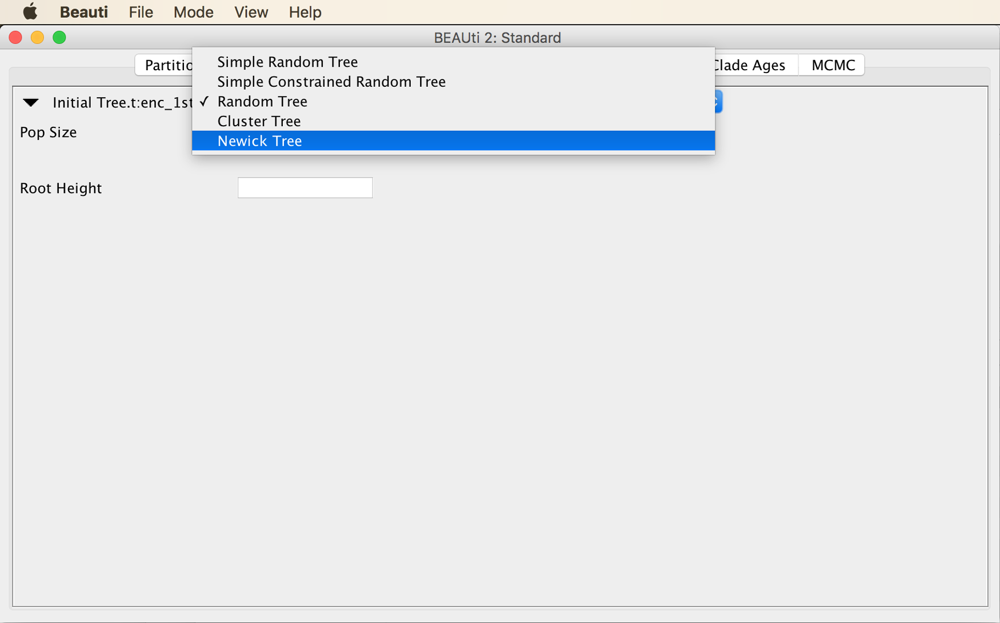
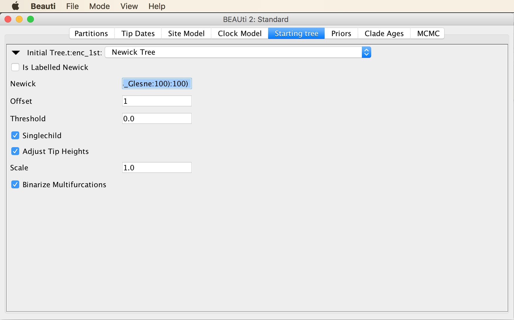
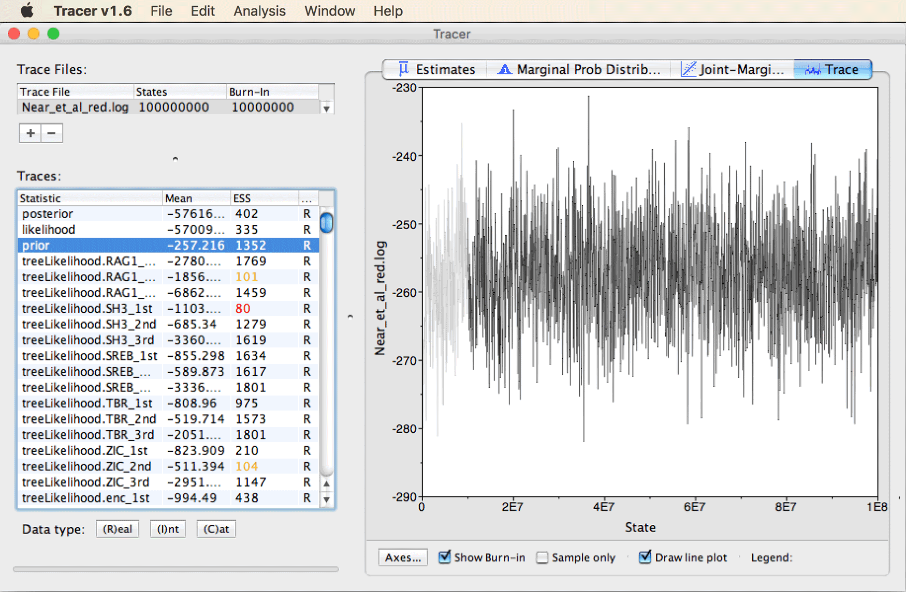

# Phylogenetic Inference and Divergence-Time Estimation

A tutorial on phylogenetic inference and divergence-time estimation with fossils

## Table of contents

* [Outline](#outline)
* [Dataset](#dataset)
* [Requirements](#requirements)
* [Phylogenetic inference and divergence-time estimation with CladeAge](#cladeage)
* [Postprocessing](#postprocessing)

## Outline

In this tutorial I am going to demonstrate the application of phylogenetic inference and divergence-time estimation based on a quantitative model of fossil sampling. Inference with this model is implemented in the CA (CladeAge) add-on package for BEAST2 ([Matschiner et al. 2017](https://academic.oup.com/sysbio/article/66/1/3/2418030)). We will apply this model to a set of fossil calibrations and a sequence alignments.

## Dataset

We are going to make use of the comprehensive dataset of [Near et al. (2013)](http://www.pnas.org/content/110/31/12738), comprising alignments for ten nuclear genes. In their study, [Near et al. (2013)](http://www.pnas.org/content/110/31/12738) used this dataset to estimate divergence times of spiny-rayed fishes (= Acanthomorphata), and to identify shifts in diversification rates among different groups of these fishes. While the dataset of [Near et al. (2013)](http://www.pnas.org/content/110/31/12738) did not focus on cichlid diversification, it included nine cichlid species among the 520 species sampled for the extensive phylogeny. Thus, we can here use part of this dataset of [Near et al. (2013)](http://www.pnas.org/content/110/31/12738) to estimate early divergences among cichlid fishes, and these estimates will in turn serve as calibrations in subsequent analyses of cichlid diversification in some of the following tutorials. To facilitate the analyses in this tutorial, we will reduce the dataset of [Near et al. (2013)](http://www.pnas.org/content/110/31/12738) to sequences from only selected 24 species. These species represent divergent cichlid lineages as well as the most ancestral groups of spiny-rayed fishes so that the fossil record of these lineages can be employed for calibration.

## Requirements

* **BEAST2:** A program package for Bayesian phylogenetic inference ([https://www.beast2.org](https://www.beast2.org)). The BEAST2 package also includes BEAUti and TreeAnnotator, two tools that we will be using in addition to BEAST2 itself.

* **Tracer:** A tool for inspection of MCMC chains, as those produced by BEAST2 ([http://beast.community/tracer](http://beast.community/tracer)).

* **FigTree:** A tool for the visualization of phylogenies ([http://tree.bio.ed.ac.uk/software/figtree/](http://tree.bio.ed.ac.uk/software/figtree/)).

## Phylogenetic inference and divergence-time estimation with CladeAge

The approach for phylogenetic inference and divergence-time estimation that will be applied in this tutorial is the CladeAge approach that I developed together with colleagues in our study [Matschiner et al. (2017)](https://academic.oup.com/sysbio/article/66/1/3/2418030). With this approach, prior densities are defined for the ages of different clades, and the minimum ages of these prior densities are provided by the oldest fossils of these clades. The shape of these prior densities is informed by a model of diversification and fossil sampling. More details about the CladeAge approach can be found in our paper ([Matschiner et al. 2017](https://academic.oup.com/sysbio/article/66/1/3/2418030)), and further information on its application is given in our [Rough Guide to CladeAge](http://evoinformatics.eu/cladeage.pdf).

* Download the molecular dataset of [Near et al. (2013)](http://www.pnas.org/content/110/31/12738) from the Dryad data repository connected to their publication:

		wget -O Near_et_al.nex https://datadryad.org/stash/downloads/file_stream/86454
	
	This file in Nexus format contains the sequence alignments for ten nuclear markers, sequenced for 608 species of spiny-rayed fishes. As this dataset is far too large to be analyzed in this tutorial, we'll extract the sequences of 24 species that represent major groups of spiny-rayed fishes ([Betancur-R. et al. 2017](https://bmcevolbiol.biomedcentral.com/articles/10.1186/s12862-017-0958-3)) as well as the most divergent groups of cichlid fishes.
	
The 24 species that we will focus on are listed in the table below.

| ID                       | Species                   | Group                |
|--------------------------|---------------------------|----------------------|
| Oreochromis_niloticus    | *Oreochromis niloticus*   | African cichlids     |
| Heterochromis_multidensA | *Heterochromis multidens* | African cichlids     |
| Cichla_temensisA         | *Cichla temensis*         | Neotropical cichlids |
| Heros_appendictulatusA   | *Heros appendictulatus*   | Neotropical cichlids |
| Etroplus_maculatusA      | *Etroplus maculatus*      | Indian cichlids      |
| Oryzias_latipes          | *Oryzias latipes*         | Atherinomorphae      |
| Trachinotus_carolinusA   | *Trachinotus carolinus*   | Carangaria           |
| Channa_striataA          | *Channa striata*          | Anabantiformes       |
| Monopterus_albusA        | *Monopterus albus*        | Synbranchiformes     |
| Gasterosteus_acuC        | *Gasterosteus aculeatus*  | Eupercaria           |
| Astrapogon_stellatusA    | *Astrapogon tellatus*     | Gobiaria             |
| Aulostomus_chinensisA    | *Aulostomus chinensis*    | Syngnatharia         |
| Thunnus_albacaresA       | *Thunnus albacares*       | Pelagaria            |
| Porichthys_notatusA      | *Porichthys notatus*      | Batrachoidiaria      |
| Diplacanthopoma_brunneaA | *Diplacanthopoma brunnea* | Ophidiaria           |
| Sargocentron_cornutumA   | *Sargocentron cornutum*   | Holocentrimorphaceae |
| Rondeletia_loricataA     | *Rondeletia loricata*     | Beryciformes         |
| Monocentris_japonicaA    | *Monocentris japonica*    | Trachichthyiformes   |
| Polymixia_japonicaA      | *Polymixia japonica*      | Polymixiipterygii    |
| Regalecus_Glesne         | *Regalecus glesne*        | Lampripterygii       |
| Percopsis_omiscomaycusA  | *Percopsis omiscomaycus*  | Percopsaria          |
| Zenopsis_conchiferaB     | *Zenopsis conchifera*     | Zeiariae             |
| Stylephorus_chordatusB   | *Stylephorus chordatus*   | Stylephoriformes     |
| Gadus_morhua             | *Gadus morhua*            | Gadiformes           |

* A list of the 24 species IDs in plain text format is also in file [`Near_et_al_ids.txt`](https://raw.githubusercontent.com/mmatschiner/BIO395_2020/main/data/Near_et_al_ids.txt). Download this file by clicking on the link or by using this command:

		wget https://raw.githubusercontent.com/mmatschiner/BIO395_2020/main/data/Near_et_al_ids.txt

* Use the file with the 24 IDs to extract the sequences of these species from the full alignment, and write them to a new file in Nexus format named `Near_et_al_red.nex`, using the following set of commands:

		head -n 7 Near_et_al.nex | sed 's/ntax=608/ntax=24/g'> Near_et_al_red.nex
		grep -f Near_et_al_ids.txt -e "\[" Near_et_al.nex | sed -e $'s/\[/\\\n\[/g' >> Near_et_al_red.nex
		tail -n 35 Near_et_al.nex | sed 's/paup/assumptions/g' >> Near_et_al_red.nex

* To specify fossil constraints as calibrations points in BEAUti according to the CladeAge model of [Matschiner et al. (2017)](https://academic.oup.com/sysbio/article/66/1/3/2418030), we'll first have to install the CladeAge add-on package for BEAST2. To do so, open BEAUti, and click on "Manage Packages" in the "File" menu. This will open a window for the BEAST2 Package Manager. In this window, select "CA" and click "Intstall/Upgrade" as shown in the screenshot below.

* Also install a second package, namely the "bModelTest" package, again by selecting this package and clicking "Install/Upgrade". This package enables an automatic selection of the best-fitting substitution model.

* Close and reopen BEAUti. You should then see that an additional tab has been added named "Clade Ages", as in the screenshot below.

* Now click on "Import Alignment" in the "File" menu, and select file `Near_et_al_red.nex`. BEAUti should then recognize 30 different partitions, one for each codon position of each of the ten markers. The BEAUti window should then look as shown in the screenshot below.

* Select all partitions, and click "Link Trees" as well as "Link Clock Models", as shown below.

* Go the the "Site Model" tab, and select "BEAST Model Test" from the drop-down menu at the top of the window, as shown below (if this option is not available for you then you probably forgot to install the "bModelTest" package as described above).

* Select "namedExtended" from the drop-down menu that at first had "transitionTransversionSplit" selected. Leave the checkbox next to "Empirical" unticked to allow estimation of nucleotide frequencies. Then, set the tick to the right of "Mutation Rate" to specify that this rate should be estimated. The window should then look as in the next screenshot.

* Select all partitions in the list at the left of the window, and click "OK" to clone the substitution model from the first partition to all other partitions, as shown below.

* In the "Clock Model" tab, select the "Relaxed Clock Log Normal" clock model, as shown in the next screenshot.

* Because we are going to calibrate the molecular clock with fossil constraints, we should allow the clock rate to be estimated. By default, however, the checkbox that we would need to tick, next to "estimate" at the bottom right, is disabled. To enable this checkbox, click on "Automatic set clock rate" in BEAUti's "Mode" menu as shown in the net screenshot.

* You should then be able to set a tick in the checkbox at the bottom right as shown below to allow the estimation of the clock rate.

* In the "Priors" tab, select the "Birth Death Model" as the tree prior, from the drop-down menu at the very top of the window, as shown below.

* Open the "Priors" tab and click on the "+ Add Prior" button, as shown in the next screenshot.

* We will now have to specify a rather long list of constraints to make the best possible use of the information provided by the fossil record and to obtain divergence time estimates that are as reliable as possible given our dataset. We'll start simple by specifying that the origin of African cichlid tribe *Heterochromini*, represented in our dataset by *Heterochromis multidens*, must have occurred at least 15.97-33.9 million years ago (Ma), since this is the age of the oldest fossil of Heterochromi, which was reported from the Baid Formation of Saudi Arabia by [Lippitsch and Micklich (1998)](https://www.tandfonline.com/doi/abs/10.1080/11250009809386810). Thus, specify "Heterochromini" in the field next to "Taxon set label", and select only "Heterochromis\_multidensA" as the ingroup of this taxon set, as shown below.

* After you click "OK", you'll see the following window, in which you can specify minimum and maximum values for the parameters net-diversification rate, turnover rate, and sampling rate. Based on these values as well as the fossil age, the CladeAge model is going to automatically determine the optimal shape of the prior density used for each constraint. The CladeAge model thus removes the previous requirement of specifying these densities manually, which in practice was often done rather arbitrarily. This practice is problematic because the shapes of prior densities for age calibrations are known to have a great influence on the resulting divergence-time estimates, which was the main motivation for me to develop the CladeAge model. However, note that other solutions to the same problem exist, such as the fossilized birth-death model ([Heath et al. 2014](http://www.pnas.org/content/111/29/E2957); [Gavryushkina et al. 2017](https://academic.oup.com/sysbio/article/66/1/57/2670056)).

* While it might be preferable to estimate the net-diversification rate (speciation minus extinction) and the turnover (extinction divided by speciation) as part of the analysis, this is not implemented in the CladeAge model. Instead, the values for the two parameters have to be specified *a priori*, together with the "sampling rate", the rate at which fossils that are eventually sampled by scientists were once deposited in the fossil record. Fortunately, estimates for these three rates can be found in the literature, and the confidence intervals for these estimates can be accounted for by the CladeAge model. Here, as in [Matschiner et al. (2017)](https://academic.oup.com/sysbio/article/66/1/3/2418030), we adopt estimates for net-diversification and turnover of teleost fishes from [Santini et al. (2009)](https://bmcevolbiol.biomedcentral.com/articles/10.1186/1471-2148-9-194), and a sampling-rate estimate for bony fishes from [Foote and Miller (2007)](https://books.google.ch/books/about/Principles_of_Paleontology.html?id=8TsDC2OOvbYC&redir_esc=y). These estimates are 0.041-0.081 for the net-diversification rate, 0.0011-0.37 for the turnover, and 0.0066-0.01806 for the sampling rate. Thus, enter these ranges as shown in the next screenshot.

* While these three rate estimates are going to apply to all fossil constraints, information specific to the fossil constraint still must be added. To do so for the constraint on the age of Heterochromini, click on the triangle to the left of "Heterochromini". You'll see two more fields in which you can specify minimum and maximum values for the "First occurrence age" (the age of the oldest fossil of the clade). Specify the known age of the oldest fossil of Heterochromini in million of years, 15.97-33.9, as shown below:

* It is also possible to preview the shape of the prior densities as calculated by CladeAge based on the specified parameters. To do so, you may have to increase the window size so that you can click on the "Preview" button below the icon on the right. A plot outlining the prior densities should then appear as in the screenshot below.

From this plot, you can see that under the assumption that all specified model parameters are correct, there's a good probability that Heterochromini originated some time between 25 and 80 Ma. While this range is rather wide, it is based on only one fossil; we will obtain more precise estimates when we run the phylogenetic analysis with multiple fossil constraints.

* Click the triangle to the left of "Heterochromini" again to close the section with details on this fossil constraint, and add further fossil constraints for the clades listed below (if you get tired of adding these constraints and rather use a prepared input file for BEAST2, just read through the next three steps and then download file [`Near_et_al_red.xml`](https://raw.githubusercontent.com/mmatschiner/BIO395_2020/main/data/Near_et_al_red.xml):
	* **"Other African cichlid tribes"** Ingroup: *Oreochromis niloticus* ("Oreochromis\_niloticus") Oldest fossil species: *Mahengechromis* spp. First occurrence age: 45.0-46.0 Ma
	* **"African cichlids"** Ingroup: *Heterochromis multidens* ("Heterochromis\_multidensA"), *Oreochromis niloticus* ("Oreochromis\_niloticus") Oldest fossil species: *Mahengechromis* spp. First occurrence age: 45.0-46.0 Ma
	* **"Retroculini and Cichlini"** Ingroup: *Cichla temensis* ("Cichla\_temensisA") Oldest fossil species: *Palaeocichla longirostrum* First occurrence age: 5.332-23.03 Ma
	* **"Other Neotropical cichlid tribes"** Ingroup: *Heros appendictulatus* ("Heros\_appendictulatusA") Oldest fossil species: *Plesioheros chauliodus* First occurrence age: 39.9-45.0 Ma
	* **"Neotropical cichlids"** Ingroup: *Cichla temensis* ("Cichla\_temensisA"), *Heros appendictulatus* ("Heros\_appendictulatusA") Oldest fossil species: *Plesioheros chauliodus* First occurrence age: 39.9-45.0 Ma
	* **"Afro-American cichlids"** Ingroup: *Cichla temensis* ("Cichla\_temensisA"), *Heros appendictulatus* ("Heros\_appendictulatusA"), *Heterochromis multidens* ("Heterochromis\_multidensA"), *Oreochromis niloticus* ("Oreochromis\_niloticus") Oldest fossil species: *Mahengechromis* spp. First occurrence age: 45.0-46.0 Ma
	* **"Cichlids"** *Cichla temensis* ("Cichla\_temensisA"), *Etroplus maculatus* ("Etroplus\_maculatusA"), *Heros appendictulatus* ("Heros\_appendictulatusA"), *Heterochromis multidens* ("Heterochromis\_multidensA"), *Oreochromis niloticus* ("Oreochromis\_niloticus") Oldest fossil species: *Mahengechromis* spp. First occurrence age: 45.0-46.0 Ma
	* **"Atherinomorphae"** Ingroup: *Oryzias latipes* ("Oryzias\_latipes") Oldest fossil species: *Rhamphexocoetus volans* First occurrence age: 49.1-49.4 Ma
	* **"Ovalentaria"** Ingroup: *Cichla temensis* ("Cichla\_temensisA"), *Etroplus maculatus* ("Etroplus\_maculatusA"), *Heros appendictulatus* ("Heros\_appendictulatusA"), *Heterochromis multidens* ("Heterochromis\_multidensA"), *Oreochromis niloticus* ("Oreochromis\_niloticus"), *Oryzias latipes* ("Oryzias\_latipes") Oldest fossil species: *Rhamphexocoetus volans* First occurrence age: 49.1-49.4 Ma
	* **"Carangaria"** Ingroup: *Trachinotus carolinus* ("Trachinotus\_carolinusA") Oldest fossil species: *Trachicaranx tersus* First occurrence age: 55.8-57.23 Ma
	* **"Anabantiformes"** Ingroup: *Channa striata* ("Channa\_striataA") Oldest fossil species: *Osphronemus goramy* First occurrence age: 45.5-50.7 Ma
	* **"Anabantaria"** Ingroup: *Channa striata* ("Channa\_striataA"), *Monopterus albus* ("Monopterus\_albusA") Oldest fossil species: *Osphronemus goramy* First occurrence age: 45.5-50.7 Ma
	* **"Eupercaria"** Ingroup: *Gasterosteus aculeatus* ("Gasterosteus_acuC") Oldest fossil species: *Cretatriacanthus guidottii* First occurrence age: 83.5-99.6 Ma
	* **"Gobiaria"** Ingroup: *Astrapogon tellatus* ("Astrapogon\_stellatusA") Oldest fossil species: *"Gobius" gracilis* First occurrence age: 30.7-33.9 Ma
	* **"Syngnatharia"** Ingroup: *Aulostomus chinensis* ("Aulostomus\_chinensisA") Oldest fossil species: *Prosolenostomus lessinii* First occurrence age: 49.1-49.4 Ma
	* **"Pelagaria"** Ingroup: *Thunnus albacares* ("Thunnus\_albacaresA") Oldest fossil species: *Eutrichiurides opiensis* First occurrence age: 56.6-66.043 Ma
	* **"Batrachoidiaria"** Ingroup: *Porichthys notatus* ("Porichthys\_notatusA") Oldest fossil species: *Louckaichthys novosadi* First occurrence age: 27.82-33.9 Ma
	* **"Ophidiaria"** Ingroup: *Diplacanthopoma brunnea* ("Diplacanthopoma\_brunneaA") Oldest fossil species: *Eolamprogrammus senectus* First occurrence age: 55.8-57.23 Ma
	* **"Percomorphaceae"** Ingroup: *Astrapogon tellatus* ("Astrapogon\_stellatusA"), *Aulostomus chinensis* ("Aulostomus\_chinensisA"), *Channa striata* ("Channa\_striataA"), *Cichla temensis* ("Cichla\_temensisA"), *Diplacanthopoma brunnea* ("Diplacanthopoma\_brunneaA"), *Etroplus maculatus* ("Etroplus\_maculatusA"), *Gasterosteus aculeatus* ("Gasterosteus_acuC"), *Heros appendictulatus* ("Heros\_appendictulatusA"), *Heterochromis multidens* ("Heterochromis\_multidensA"), *Monopterus albus* ("Monopterus\_albusA"), *Oreochromis niloticus* ("Oreochromis\_niloticus"), *Oryzias latipes* ("Oryzias\_latipes"), *Porichthys notatus* ("Porichthys\_notatusA"), *Thunnus albacares* ("Thunnus\_albacaresA"), *Trachinotus carolinus* ("Trachinotus\_carolinusA") Oldest fossil species: *Cretatriacanthus guidottii* First occurrence age: 83.5-99.6 Ma
	* **"Holocentrimorphaceae"** Ingroup: *Sargocentron cornutum* (Sargocentron\_cornutumA) Oldest fossil species: *Caproberyx pharsus* First occurrence age: 97.8-99.1 Ma
	* **"Acanthopterygii"** Ingroup: *Astrapogon tellatus* ("Astrapogon\_stellatusA"), *Aulostomus chinensis* ("Aulostomus\_chinensisA"), *Channa striata* ("Channa\_striataA"), *Cichla temensis* ("Cichla\_temensisA"), *Diplacanthopoma brunnea* ("Diplacanthopoma\_brunneaA"), *Etroplus maculatus* ("Etroplus\_maculatusA"), *Gasterosteus aculeatus* ("Gasterosteus_acuC"), *Heros appendictulatus* ("Heros\_appendictulatusA"), *Heterochromis multidens* ("Heterochromis\_multidensA"), *Monocentris japonica* ("Monocentris\_japonicaA"), *Monopterus albus* ("Monopterus\_albusA"), *Oreochromis niloticus* ("Oreochromis\_niloticus"), *Oryzias latipes* ("Oryzias\_latipes"), *Porichthys notatus* ("Porichthys\_notatusA"), *Rondeletia loricata* ("Rondeletia\_loricataA"), *Thunnus albacares* ("Thunnus\_albacaresA"), *Trachinotus carolinus* ("Trachinotus\_carolinusA"), *Sargocentron cornutum* (Sargocentron\_cornutumA) Oldest fossil species: *Caproberyx pharsus* First occurrence age: 97.8-99.1 Ma
	* **"Polymixiipterygii"** Ingroup: *Polymixia japonica* ("Polymixia\_japonicaA") Oldest fossil species: *Homonotichthys rotundus* First occurrence age: 93.5-96.0 Ma
	* **"Percopsaria"** Ingroup: *Percopsis omiscomaycus* ("Percopsis\_omiscomaycusA") Oldest fossil species: *Mcconichthys longipinnis* First occurrence age: 61.1-66.043 Ma
	* **"Zeiariae"** Ingroup: *Zenopsis conchifera* ("Zenopsis\_conchiferaB") Oldest fossil species: *Cretazeus rinaldii* First occurrence age: 69.2-76.4 Ma
	* **"Gadiformes"** Ingroup: *Gadus morhua* ("Gadus\_morhua") Oldest fossil species: *Protacodus* sp. First occurrence age: 59.7-62.8 Ma
	* **"Paracanthopterygii"** Ingroup: *Gadus morhua* ("Gadus\_morhua"), *Percopsis omiscomaycus* ("Percopsis\_omiscomaycusA"), *Stylephorus chordatus* ("Stylephorus\_chordatusB"), *Zenopsis conchifera* ("Zenopsis\_conchiferaB") Oldest fossil species: *Cretazeus rinaldii* First occurrence age: 69.2-76.4 Ma

	If you should be interested in details and references, you can find more information about the above constraints in the Supplementary Material of [Matschiner et al. (2017)](https://academic.oup.com/sysbio/article/66/1/3/2418030).
	
	Once all these constraints are added, the BEAUti window should look as shown below.

* Move on to the "MCMC" tab. Specify an MCMC chain length of 100 million iterations, name the log file `Near_et_al_red.log` and the tree file `Near_et_al_red.trees`. The BEAUti window should then look as in the next screenshot.

* Save the analysis settings to a new file named `Near_et_al_red.xml` by clicking "Save As" in BEAUti's "File" menu. Do not close the BEAUti window yet.

* Open BEAST2, load file `Near_et_al_red.xml` as in the screenshot below, and try running the MCMC analysis.

Most likely, the MCMC analysis is going to crash right at the start with an error message as shown below.

This is a common problem when several fossil constraints are specified: According to the error message, BEAST2 could not find a proper state to initialise. This means that even after several attempts, no starting state of the MCMC chain could be found that had a non-zero probability. Most often, the issue is that the tree that BEAST2 randomly generates to start the chain is in conflict with one or more fossil constraints. The way to fix this issue is to specify a starting tree that is in agreement with the specified fossil constraints. In particular, because all fossil constraints imposed hard minimum ages on the origin of the respective clades, these clades must at least be as old as the minimum age in the starting tree. In case of doubt, it is usually safer to make the starting tree too old rather than too young, the course of the MCMC chain should, at least after the burnin, not be influenced by the starting state anymore anyway. Some helpful advice on how to specify starting trees is provided on the [BEAST2](https://www.beast2.org/fix-starting-tree/) webpage. With trees of hundreds of taxa, generating a suitable starting tree can be a tricky task in itself, but with the small number of 24 species used here, it was easier to write a starting tree by hand.

* Open the program FigTree, and then copy and paste the below starting tree string into a new FigTree window.

		((((((((((((((Oreochromis_niloticus:50,Heterochromis_multidensA:50):10,(Cichla_temensisA:50,Heros_appendictulatusA:50):10):10,Etroplus_maculatusA:70):30,Oryzias_latipes:100):10,(Trachinotus_carolinusA:70,(Channa_striataA:60,Monopterus_albusA:60):10):40):10,Gasterosteus_acuC:120):10,Astrapogon_stellatusA:130):10,(Aulostomus_chinensisA:80,Thunnus_albacaresA:80):60):10,Porichthys_notatusA:150):10,Diplacanthopoma_brunneaA:160):10,Sargocentron_cornutumA:170):10,(Rondeletia_loricataA:100,Monocentris_japonicaA:100):80):10,Polymixia_japonicaA:190):10,((((Gadus_morhua:70,Stylephorus_chordatusB:70):10,Zenopsis_conchiferaB:80):10,Percopsis_omiscomaycusA:90):10,Regalecus_Glesne:100):100)
		
	Then, set a tick next to "Node Labels" to display node ages. As you'll see, I just arbitrarily specified for most branches a length of 10 million years, and I made sure that particularly the more recent divergence events agree with the respective fossil constraints (e.g. by placing the divergence of *Oreochromis niloticus* and *Heterochromis multidens* at 50 Ma because the origin of the clade "Other African cichlid tribes", represented by *Oreochromis niloticus* is constrained to be at least 45 million years old).
	
There are two ways to specify starting trees for BEAST2 analyses; either again using BEAUti or by editing the XML file in a text editor. If you downloaded file [`Near_et_al_red.xml`](https://raw.githubusercontent.com/mmatschiner/BIO395_2020/main/data/Near_et_al_red.xml) instead of setting it up completely in BEAUti, you may need to add the starting tree using a text editor (see below after the next four steps).
	
* To add the starting tree using BEAUti, click on the "View" menu and select "Show Starting tree panel", as shown in the next screenshot.

The starting tree panel should appear, as in the screenshot below.

	
* From the menu at the top of the panel, choose "Newick Tree", as shown in the next screenshot.

* Then, copy the starting tree string into the input field next to "Newick", as shown below.

	
* Save the file after adding the tree string.

If for some reason adding the starting tree in BEAUti should not work, this can alternatively be done in a text editor, as described below (if you did add it in BEAUti, you may skip the next three steps):

* Open file `Near_et_al_red.xml` in a text editor and find a block on lines 339-344.

		<init id="RandomTree.t:ZIC_2nd" spec="beast.evolution.tree.RandomTree" estimate="false" initial="@Tree.t:enc_1st">
			<taxa id="ZIC_2nd" spec="FilteredAlignment" data="@Near_et_al_red" filter="7697-8576\3"/>
			<populationModel id="ConstantPopulation0.t:ZIC_2nd" spec="ConstantPopulation">
				<parameter id="randomPopSize.t:ZIC_2nd" name="popSize">1.0</parameter>
			</populationModel>
		</init>

* Replace the above block with the code below, which contains the starting tree string:

		<init spec="beast.util.TreeParser" id="NewickTree.t:enc_1st"
			initial="@Tree.t:enc_1st"
			IsLabelledNewick="true"
			newick="((((((((((((((Oreochromis_niloticus:50,Heterochromis_multidensA:50):10,(Cichla_temensisA:50,Heros_appendictulatusA:50):10):10,Etroplus_maculatusA:70):30,Oryzias_latipes:100):10,(Trachinotus_carolinusA:70,(Channa_striataA:60,Monopterus_albusA:60):10):40):10,Gasterosteus_acuC:120):10,Astrapogon_stellatusA:130):10,(Aulostomus_chinensisA:80,Thunnus_albacaresA:80):60):10,Porichthys_notatusA:150):10,Diplacanthopoma_brunneaA:160):10,Sargocentron_cornutumA:170):10,(Rondeletia_loricataA:100,Monocentris_japonicaA:100):80):10,Polymixia_japonicaA:190):10,((((Gadus_morhua:70,Stylephorus_chordatusB:70):10,Zenopsis_conchiferaB:80):10,Percopsis_omiscomaycusA:90):10,Regalecus_Glesne:100):100)">
			<taxa id="ZIC_2nd" spec="FilteredAlignment" data="@Near_et_al_red" filter="7697-8576\3"/>
		</init>

* Save the file again under the same name.

After adding the starting tree string either in BEAUti or with a text editor, continue here.

* Open the XML file again in BEAST2, and try running the analysis again. This time, the MCMC should begin to run.

**Question 1:** How long does BEAST2 take to run one million MCMC iterations? [(see answer)](#q1)

* After realizing that we will not have enough time to allow BEAST2 to run for  the 100 million iterations that we specified as the run length in BEAUti, cancel the BEAST2 analysis and continue the rest of tutorial with result files that I prepared earlier. To do so, close the BEAST2 window with Command-Q.

* Download the prepared result files [`Near_et_al_red.log`](https://raw.githubusercontent.com/mmatschiner/BIO395_2020/main/res/Near_et_al_red.log) and [`Near_et_al_red.trees`](https://raw.githubusercontent.com/mmatschiner/BIO395_2020/main/res/Near_et_al_red.trees).

## Postprocessing

We are now going to use the program [Tracer](http://tree.bio.ed.ac.uk/software/tracer/) ([Rambaut et al. 2018](https://academic.oup.com/sysbio/advance-article/doi/10.1093/sysbio/syy032/4989127)) to inspect the MCMC chain produced by the BEAST2 analysis for stationarity.

* Open Tracer and the log file [`Near_et_al_red.log`](https://raw.githubusercontent.com/mmatschiner/BIO395_2020/main/res/Near_et_al_red.log) resulting from the BEAST2 analysis with the CladeAge approach. The Tracer window should then look as shown in the next screenshot.

* The left-hand panel informs about stationarity of the estimates resulting from the MCMC. Effective sample sizes above 100 (or better 200) indicate good stationarity. Quickly browse through the long list of parameters to see if any have particularly low ESS values. We'll ignore those parameters of the bModelTest model named "hasEqualFreqs..." Besides these, the lowest ESS values are around 80, indicating that the chain is approaching stationarity, but that it should be run for more iterations if the analysis was to be published. Nevertheless, the degree of stationarity appears to be sufficient for our interpretation here.

* To see a good example of a "hairy caterpillar" trace pattern indicating stationarity, click on "prior" in the list of parameters and on the tab for "Trace" in the top right of the window. You should see a trace as shown below.

Note that in principle all traces should look similar to this pattern once the chain is fully stationary.

* Find the "TreeHeight" parameter indicating the root age in the list on the left. **Question 2:** What is the mean estimate and its confidence interval for the age of the first split in the phylogeny? [(see answer)](#q2)

* Next, find the estimated divergence time between African and Neotropical cichlid fishes. To do so, scroll to the bottom of the list on the left, select "mrcatime(Afro-American cichlids)". You'll see that this divergence event was estimated around 65 Ma, with a range of uncertainty between around 55 Ma and 75 Ma, as shown in the next screenshot.

Even though we now already have the most important result of the analysis, an estimate of the divergence time between African and Neotropical cichlid fishes, we might still like to see the phylogeny resulting from the analysis. BEAST2 has written even a large number of phylogenies to the file named [`Near_et_al_red.trees`](https://raw.githubusercontent.com/mmatschiner/BIO395_2020/main/res/Near_et_al_red.trees), representing the so-called "posterior tree distribution"; a set of trees that are all plausible given the sequence data and the model chosen for the inference (including the fossil constraints). This set of trees can sometimes be used for downstream analyses; however, for interpretation, a single summary tree is usually more useful.

* To generate a summary tree from the posterior tree distribution, open the program TreeAnnotator that is part of the BEAST2 package.

XXX [`Near_et_al_red.tre`](https://raw.githubusercontent.com/mmatschiner/BIO395_2020/main/res/Near_et_al_red.tre)

XXX 

XXX 

 

                   

## Answers

* **Question 1:** BEAST2 should require about 8-10 minutes per million iterations. Thus, running the full 100 million iterations will take about 13-15 hours. If you don't want to wait for your analyses to finish, you could use the results of my BEAST2 analysis of the same data with the CladeAge approach, in files [`Near_et_al_red.log`](res/Near_et_al_red.log) and [`Near_et_al_red.trees`](res/Near_et_al_red.trees) for the rest of the tutorial.

* **Question 2:** When you select "TreeHeight" in the list on the left and click on the tab for "Estimates" in the top right, you'll see the following information:

As specified in the summary statistics on the top right part of the window, the mean estimate for the age of the first split should be around 160 Ma. The confidence interval is reported as the "95% HPD interval", the highest-posterior-density interval containing 95% of the posterior distribution. In other words, this is the shortest interval within which 95% of the samples taken by the MCMC can be found. In this case, it is relatively wide, ranging from around 125 Ma to about 225 Ma.
